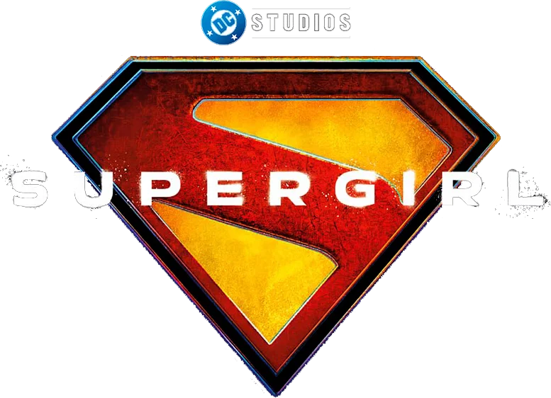

  

# Supergirl Arcade

Supergirl Arcade: Un frenético juego web retro 2D. Vuela, usa tu visión láser o aliento gélido, llama a Krypto y recolecta monedas en un bucle infinito lleno de acción. ¡Con controles táctiles integrados!

## Características Principales
- **Vuelo Omnidireccional:** Navega libremente con un sistema de scroll inmersivo y físicas de aceleración 2D.
- **Habilidades Kryptonianas:** Alterna entre Visión Térmica (Láser) y Aliento Gélido para destruir obstáculos, recoger monedas o congelarlas.
- **Compañero Fiel:** Llama a Krypto, quien orbitará a tu alrededor o volará para recolectar monedas por su cuenta según tus órdenes.
- **Soporte Multiplataforma:** Juega en PC con teclado o en dispositivos móviles gracias a sus controles de overlay táctil que detectan cuando juegas desde tu smartphone (bloqueo en formato horizontal incluido).
- **Personalización:** Controles completamente remapeables y menú de opciones con estética retro CRT.

## Controles por Defecto (PC)
- **Flechas Direccionales:** Mover a Supergirl / Navegar por los menús.
- **Z:** Disparar Habilidad / Confirmar en los menús.
- **Click / Táctil:** Cambiar habilidad activa desde el menú izquierdo.
- **F:** Silbar a Krypto (Cambiar el modo de mascota entre "Seguimiento" o "Recolección").
- **X:** Pausar partida / Cancelar o retroceder.

*(Al jugar desde móviles, los botones táctiles y el joystick virtual aparecerán automáticamente).*

## Créditos y Copyright

**Desarrollado por:** Deybidd (David Ferreiro)  
**Contacto:** davidjoseferreiro@gmail.com | [Perfil de GitHub](https://github.com/DavidFerreiro-dev)

### Propiedad Intelectual y Personajes
- **Supergirl / Kara Zor-El:** El personaje, los logotipos y los elementos del universo son propiedad exclusiva de DC Comics y Warner Bros. Discovery.
- **Inspiración Cinematográfica:** Este proyecto rinde homenaje a la futura película *Supergirl* (2026), reconociendo la visión de James Gunn en DC Studios y la imagen e interpretación de la actriz Milly Alcock.

### Banda Sonora y Música
- **Composición Original:** "Call Me", escrita e interpretada originalmente por la banda Blondie (Debbie Harry y Giorgio Moroder). Todos los derechos musicales y de publicación pertenecen a los autores originales y sus respectivas discográficas.
- **Arreglo Musical (Chiptune):** Versión instrumental retro de 8-bits creada y provista por **8 Bit Universe**. Utilizada bajo los principios de uso justo (Fair Use) y atribución explícita para este proyecto sin fines de lucro.

### Arte y Desarrollo
- **Generación de Assets (Sprites y Entornos):** Elementos gráficos pixel-art generados y curados con la asistencia de la inteligencia artificial Grok AI.
- **Código y Ensamblaje:** Desarrollado íntegramente de cero con HTML5, CSS y JavaScript "Vanilla".

---

### Aviso Legal (Disclaimer)
> *Este es un proyecto fan-made independiente, creado exclusivamente con fines educativos, de experimentación de código y entretenimiento personal. El juego no posee ánimo de lucro, no contiene monetización ni compras in-app, y no está afiliado, aprobado ni respaldado de ninguna forma por DC Comics, Warner Bros, 8 Bit Universe o cualquier otra entidad mencionada.*